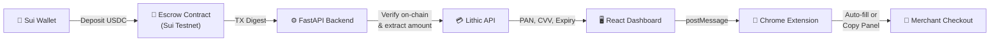

# Payzee

A crypto-to-fiat payment bridge that lets users pay at any online checkout using USDC. Deposit crypto into a Sui blockchain escrow → get a virtual Visa card → pay anywhere.

## How It Works



```
User connects wallet → Deposits USDC to escrow → Backend verifies on-chain
→ Lithic API generates virtual card → Extension auto-fills at checkout
```

**Payment Flow:**
1. User deposits USDC into a Move escrow contract on Sui
2. Backend verifies the transaction via Sui RPC and extracts the deposit amount
3. Lithic API creates a single-use virtual Visa card (with 5% buffer for fees)
4. Chrome extension detects checkout pages and fills card details automatically
5. If auto-fill fails (cross-origin iframes), a copy-paste panel is shown

## Tech Stack

| Layer | Technology |
|-------|-----------|
| **Backend** | Python, FastAPI, SQLModel, Lithic API |
| **Frontend** | React 18, Vite, Tailwind CSS, Sui Wallet Kit |
| **Smart Contract** | Move on Sui blockchain (escrow) |
| **Extension** | Chrome Manifest V3, DOM extraction, currency conversion |

## Project Structure

```
payzee/
├── backend/          # FastAPI — card creation, on-chain verification
│   └── src/          # main.py, config.py, models.py, services/
├── dashboard/        # React — wallet connection, payment UI
│   └── src/pages/    # Landing.jsx, Dashboard.jsx
├── extension/        # Chrome extension — checkout detection, auto-fill
│   ├── content.js    # Core logic
│   └── manifest.json
└── sui-escrow/       # Move smart contract
    └── sources/      # escrow.move
```

## Local Setup

**Prerequisites:** Python 3.10+, Node.js 18+

### 1. Backend
```bash
cd backend
python -m venv venv && source venv/bin/activate
pip install -r requirements.txt
```

Create `backend/.env`:
```env
API_KEY=your_api_key
LITHIC_API_KEY=your_lithic_key
LITHIC_ENVIRONMENT=sandbox
SUI_PACKAGE_ID=your_deployed_package_id
```

```bash
uvicorn src.main:app --reload --port 8000
```

### 2. Dashboard
```bash
cd dashboard
npm install
npm run dev    # → http://localhost:3001
```

### 3. Chrome Extension
1. Go to `chrome://extensions/` → enable Developer mode
2. Click **Load unpacked** → select the `extension/` folder

### 4. Smart Contract (optional)
```bash
cd sui-escrow
sui move build
sui client publish --gas-budget 100000000
```

## Environment

- Backend: `localhost:8000` • Dashboard: `localhost:3001`
- API docs: `localhost:8000/docs` (Swagger)
- Lithic runs in **sandbox** mode (test cards, no real charges)
- Sui **testnet** USDC (free tokens via faucet)
